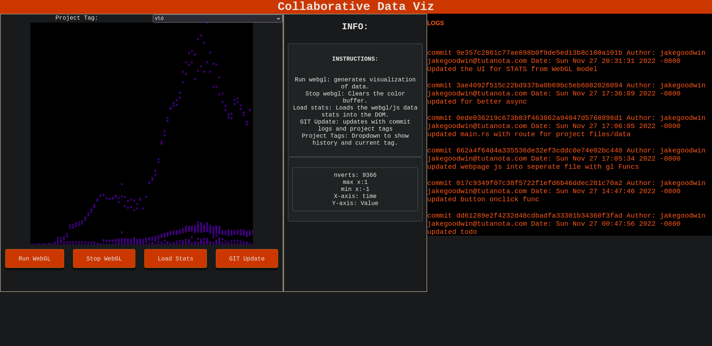

# CS443/CS553 Term Project
## Data visualization

The tool:
The project is to impliment some of the suggestions of the research paper "Data changes Everything"; citation below. 
We hope to build our data exchange and interaction tool so that we can bring the concepts of version control and shared data to a GUI style application over the web.

This will make the tooling accessible to a entire team at the same time allowing shared development and design of the data visualizations. This combined with aspects of version control will also allow testing of ideas and concepts without losing state.

The projects goals:
* Be accessible from anywhere.
* Realtime feedback options from group of peers.
* Version control of visualizations
* Shared state data visualization.
* Data can be loaded dynamically.
* Bridge the "gap" from the paper between Understanding --> design --> development of data visualizations


##Version 1.0

The new version of the functional collaborative data viz site is working!


## Instructions:
This software is at this moment capable of being compiled on FreeBSD, Linux 
and windows, but assums a bash or other unix style shell so windows will
cause issues with pipes and git if not installed on the system.

**requirements:**
- Git version control.
- Rust version 1.63 or newer.
- Cargo
- Rocket server
- Access to ports
- WebGL compadable browser

**Building from source:**

```
git clone https://github.com/goodwjak/CS443_Term_Project.git
cd CS443_Term_Project/app_server
cargo build --release
```
**Running a debugging version:**

```
git clone https://github.com/goodwjak/CS443_Term_Project.git
cd CS443_Term_Project/app_server
cargo run
```

**Building custom visualizations:**

1. go into the app_server/www/project directory
2. edit the javascript file and webGL code.
3. refreash the webpage(you shouldn't need to restart the server)
4. see your new data visualization.


### The Data:
- Electrical data over time(for an example)
- In json format or other parsable format
- Limited in size for now.

### The Stack:
This is the tech stack and the stuff that constructs the entire application at this moment

1. HTML/CSS frontend
2. JS/webGL
3. Rocket Web Server 
4. CLI tools.

### TODO:
*Things that might be nice for the next version*
- SSH keys for the project dir for syncing to remote repos.
- User Accounts for Public networks.
- Dynamic Git Tag switching asyncronously.
- Built in CSV parser/Upload menu.
- Menu tab for visual variable adjustment.
- More detailed statistics.
- Multiple Project support from single server.
- Shareable "EDIT" and "VIEW" links.

### Nice to have / Future:
- PLY file parser
- reimplimentation of polyhederon library.
- get the code functional with class datasets.
- 3d mouse controls for canvas windows.
- CSV to json regex + parsing code/script.

## sources:

**Data Changes Everything**
Walny, J., Frisson, C., West, M., Kosminsky, D., Knudsen, S., Carpendale, S., & Willett, W. J.
(2019). Data Changes Everything: Challenges and Opportunities in Data Visualization Design
Handoff. "IEEE Transactions on Visualization and Computer Graphics". 1-11.
http://hdl.handle.net/1880/110696

## Re-sources:
*these are all links to documentation and info on stuff*


**WebGL:**
* https://www.tutorialspoint.com/webgl/webgl_basics.html
* https://developer.mozilla.org/en-US/docs/Web/JavaScript/Reference/Classes
* https://webglfundamentals.org/
* https://webgl-shaders.com/index.html
* https://developer.mozilla.org/en-US/docs/Web/API/WebGL_API/WebGL_best_practices

**RustRocket:**
* https://rocket.rs/
* https://rocket.rs/v0.5-rc/guide/

**SQLite3:**
* https://www.sqlite.org/index.html
* https://docs.rs/crate/sqlite/latest

**Containers:**
* https://bastillebsd.org/
* https://docs.freebsd.org/en/books/handbook/jails/


